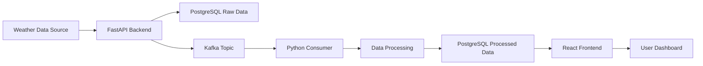

# WindSurf Analytics - Architecture Documentation

## Current Architecture Components

### 1. Backend (FastAPI)
Current Implementation:
- Framework: FastAPI
- Purpose: RESTful API service
- Features:
  - Async request handling
  - Automatic OpenAPI documentation
  - Data validation with Pydantic
  - PostgreSQL integration
  - Kafka producer integration

Alternative Options:
- Django REST Framework (More batteries included, better admin interface)
- Flask (Lighter weight, simpler)
- NestJS (TypeScript-based, enterprise-grade)
- Spring Boot (Java-based, enterprise standard)

### 2. Frontend (React)
Current Implementation:
- Framework: React
- UI Library: Material-UI
- Charting: Recharts
- Features:
  - Real-time data visualization
  - Responsive dashboard
  - Modern UI components
  - REST API integration

Alternative Options:
- Vue.js (Progressive framework, easier learning curve)
- Angular (Enterprise-grade, full featured)
- Svelte (Better performance, less boilerplate)
- Next.js (Server-side rendering, better SEO)

### 3. Message Queue (Apache Kafka)
Current Implementation:
- System: Apache Kafka
- Purpose: Real-time data streaming
- Features:
  - High throughput
  - Fault tolerance
  - Horizontal scalability
  - Message persistence

Alternative Options:
- RabbitMQ (Simpler setup, better for small-scale)
- Apache Pulsar (Better for cloud-native)
- Redis Pub/Sub (Lightweight, in-memory)
- AWS SQS (Managed service, serverless)

### 4. Database (PostgreSQL)
Current Implementation:
- Database: PostgreSQL
- ORM: SQLAlchemy
- Features:
  - ACID compliance
  - JSON support
  - Robust indexing
  - Full-text search

Alternative Options:
- MongoDB (Document-based, better for unstructured data)
- TimescaleDB (Time-series optimized PostgreSQL)
- InfluxDB (Purpose-built for time-series)
- Cassandra (Better for large-scale distributed data)

### 5. Data Processing Pipeline
Current Implementation:
- Language: Python
- Libraries: 
  - pandas (data manipulation)
  - kafka-python (Kafka integration)
  - SQLAlchemy (database ORM)
- Features:
  - Real-time data processing
  - Moving average calculations
  - Error handling
  - Data persistence

Alternative Options:
- Apache Spark (Better for big data processing)
- Apache Flink (Better for stream processing)
- Dask (Distributed computing with Python)
- Airflow (Better for workflow orchestration)

## Potential Enhancements

### 1. Monitoring & Observability
- Prometheus for metrics collection
- Grafana for visualization
- ELK Stack for log aggregation
- Jaeger for distributed tracing

### 2. Data Quality & Testing
- Great Expectations for data validation
- dbt for data transformations
- pytest for unit testing
- Locust for load testing

### 3. Security
- OAuth2 authentication
- JWT tokens
- Rate limiting
- Data encryption

### 4. DevOps & Infrastructure
- Kubernetes for orchestration
- Terraform for infrastructure as code
- GitHub Actions for CI/CD
- Docker Compose for local development

### 5. Data Features
- Machine Learning predictions
- Anomaly detection
- Historical data analysis
- Data archiving strategy

## Data Flow

## Scaling Considerations

### Horizontal Scaling
- Backend: Multiple FastAPI instances behind load balancer
- Kafka: Multiple brokers in cluster
- Database: Read replicas and sharding
- Consumer: Multiple consumer instances in group

### Vertical Scaling
- Increase CPU/Memory for compute-intensive processes
- Optimize database queries and indexing
- Cache frequently accessed data
- Batch processing for heavy computations

## Best Practices

### Code Organization
- Follow clean architecture principles
- Implement dependency injection
- Use type hints and documentation
- Follow language-specific style guides

### Development Workflow
- Use feature branches
- Write comprehensive tests
- Document API changes
- Regular security updates

### Monitoring
- Set up health checks
- Monitor system metrics
- Track error rates
- Set up alerts

## Future Roadmap Suggestions

1. Short Term (1-3 months)
   - Add authentication system
   - Implement caching layer
   - Add comprehensive testing
   - Set up monitoring

2. Medium Term (3-6 months)
   - Add machine learning predictions
   - Implement data archiving
   - Add user management
   - Enhance visualization options

3. Long Term (6+ months)
   - Geographic distribution
   - Multi-tenant support
   - Advanced analytics
   - Mobile application
