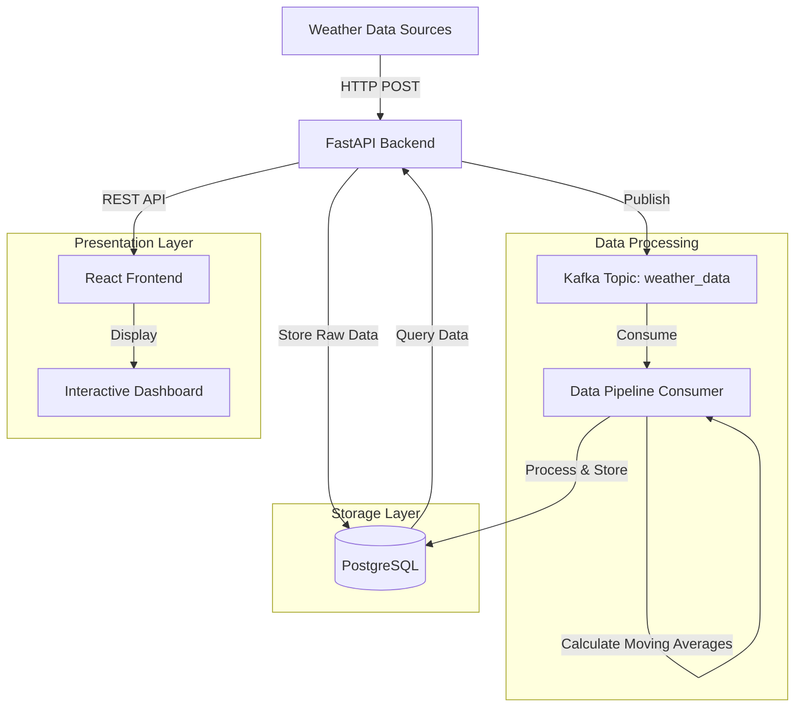

# WindSurf Analytics Architecture

## System Overview

WindSurf Analytics is a real-time weather data analytics platform for windsurfing locations. The system follows a modern microservices architecture with event-driven data processing.

## Data Flow Diagram



## Component Details

### 1. Backend Service (FastAPI)
- **Technology**: Python FastAPI
- **Responsibilities**:
  - Expose REST API endpoints
  - Validate incoming weather data
  - Store raw data in PostgreSQL
  - Publish events to Kafka
- **Key Features**:
  - CORS support for frontend integration
  - Async request handling
  - Data validation using Pydantic models

### 2. Data Pipeline
- **Technology**: Python with Kafka-Python
- **Components**:
  - Kafka Producer (integrated in Backend)
  - Kafka Consumer (standalone service)
- **Processing Features**:
  - Real-time data ingestion
  - Moving average calculations
  - Data enrichment
  - Anomaly detection

### 3. Database (PostgreSQL)
- **Tables**:
  - `weather_data`: Raw weather measurements
  - `processed_weather_data`: Enriched data with analytics
- **Key Fields**:
  - Location
  - Wind speed & direction
  - Temperature
  - Wave height
  - Timestamps
  - Calculated metrics

### 4. Message Broker (Kafka)
- **Version**: Confluent Kafka
- **Topics**:
  - `weather_data`: Raw weather measurements
- **Configuration**:
  - Single broker setup
  - Zookeeper for cluster management
  - PLAINTEXT protocol

### 5. Frontend (React)
- **Technology**: React.js
- **Features**:
  - Real-time data visualization
  - Interactive dashboards
  - Location-based filtering
  - Responsive design

## Infrastructure

### Docker Containers
1. `backend`: FastAPI application
2. `frontend`: React development server
3. `consumer`: Data pipeline service
4. `db`: PostgreSQL database
5. `kafka`: Kafka broker
6. `zookeeper`: Kafka cluster management

### Network Configuration
- Backend API: Port 8000
- Frontend: Port 3000
- PostgreSQL: Port 5432
- Kafka: Port 9092
- Internal Docker network for service communication

## Data Flow Process

1. **Data Ingestion**
   ```
   Weather Station → HTTP POST → Backend API → Raw Storage
                                     ↓
                                   Kafka
   ```

2. **Data Processing**
   ```
   Kafka Topic → Consumer → Data Processing → Enriched Storage
   ```

3. **Data Serving**
   ```
   Client Request → Frontend → Backend API → Database Query → Response
   ```

## Future Enhancements

1. **Scalability**
   - Kafka partition scaling
   - Database replication
   - Load balancing

2. **Features**
   - Weather forecasting integration
   - Historical data analysis
   - User preferences and alerts
   - Mobile app support

3. **Monitoring**
   - Prometheus metrics
   - Grafana dashboards
   - Error tracking
   - Performance monitoring

## Best Practices

1. **Data Quality**
   - Input validation
   - Data consistency checks
   - Error handling
   - Data retention policies

2. **Security**
   - API authentication
   - Data encryption
   - Secure communication
   - Regular security updates

3. **Performance**
   - Database indexing
   - Query optimization
   - Caching strategies
   - Batch processing when appropriate

4. **Development**
   - Code versioning
   - CI/CD pipeline
   - Testing strategy
   - Documentation maintenance
